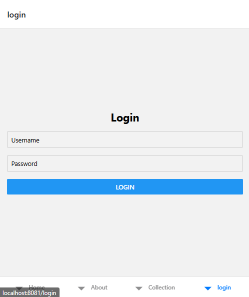
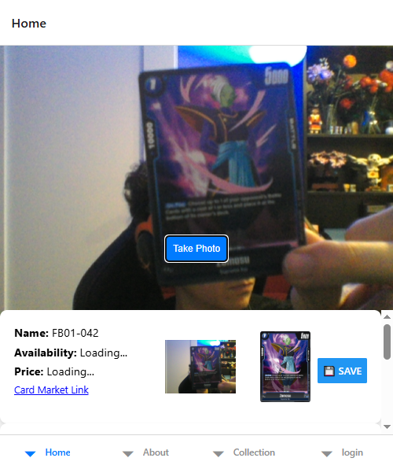
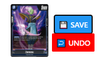
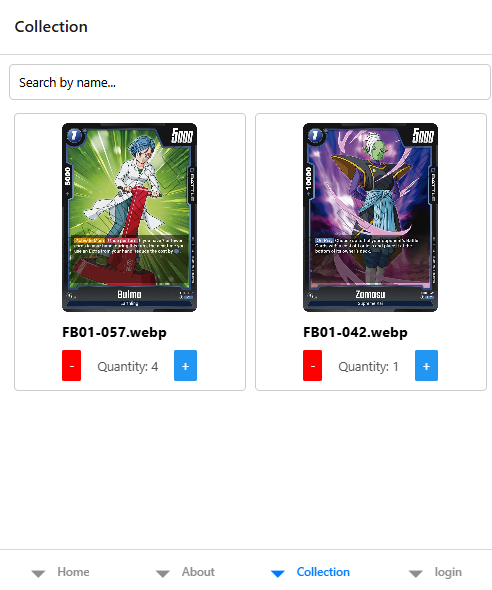

# DragonBall Fusion World CardScanner  👋

## Features
0. Login to your account
- 
1. Detect card using template matching algorithm
2. Display details & price of card (price WIP)
- 
1. Save scanned card to collection
- 
1. Browse cards in your collection & add/remove quantity
-  

## Work to be done
- [ ] card prices (backend logic done, but requires caching for effective scraping)
- [ ] create nice UI in figma
- [ ] editing scanned card in case of mistake
- [ ] manually adding card via name in collection
- [ ] decks
- [ ] export/import cards to deck or collection via standard pastebins in fusion world (client/other similar sites)
- [ ] proxy creation in pdf
- [ ] host this somewhere

## Backend
1. https://github.com/elkolorado/db-fusion-world-scanner-backend (currently private)

## Get started
This is an [Expo](https://expo.dev) project created with [`create-expo-app`](https://www.npmjs.com/package/create-expo-app).
1. Install dependencies

   ```bash
   npm install
   ```

2. Start the app

   ```bash
    npx expo start #for android
    npx expo web #for web
   ```

In the output, you'll find options to open the app in a

- [development build](https://docs.expo.dev/develop/development-builds/introduction/)
- [Android emulator](https://docs.expo.dev/workflow/android-studio-emulator/)
- [iOS simulator](https://docs.expo.dev/workflow/ios-simulator/)
- [Expo Go](https://expo.dev/go), a limited sandbox for trying out app development with Expo

You can start developing by editing the files inside the **app** directory. This project uses [file-based routing](https://docs.expo.dev/router/introduction).

## Learn more

To learn more about developing your project with Expo, look at the following resources:

- [Expo documentation](https://docs.expo.dev/): Learn fundamentals, or go into advanced topics with our [guides](https://docs.expo.dev/guides).
- [Learn Expo tutorial](https://docs.expo.dev/tutorial/introduction/): Follow a step-by-step tutorial where you'll create a project that runs on Android, iOS, and the web.

## Join the community

Join our community of developers creating universal apps.

- [Expo on GitHub](https://github.com/expo/expo): View our open source platform and contribute.
- [Discord community](https://chat.expo.dev): Chat with Expo users and ask questions.
